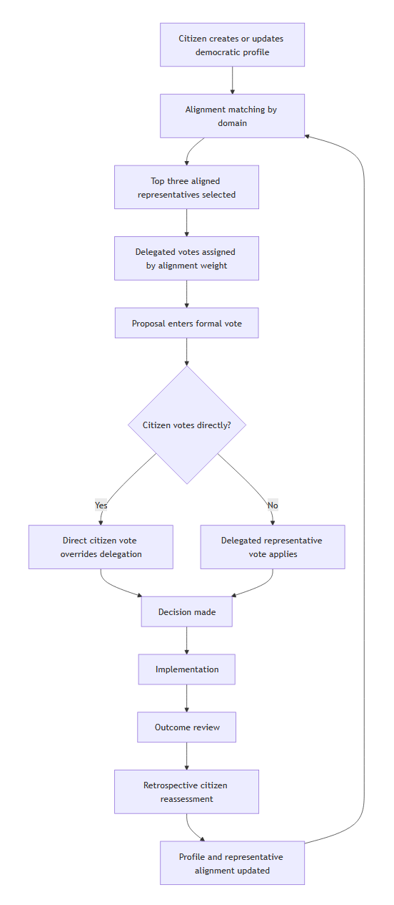
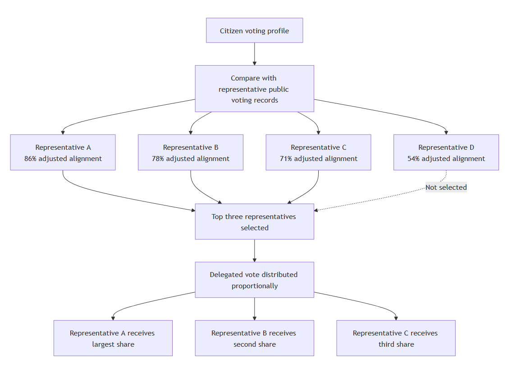
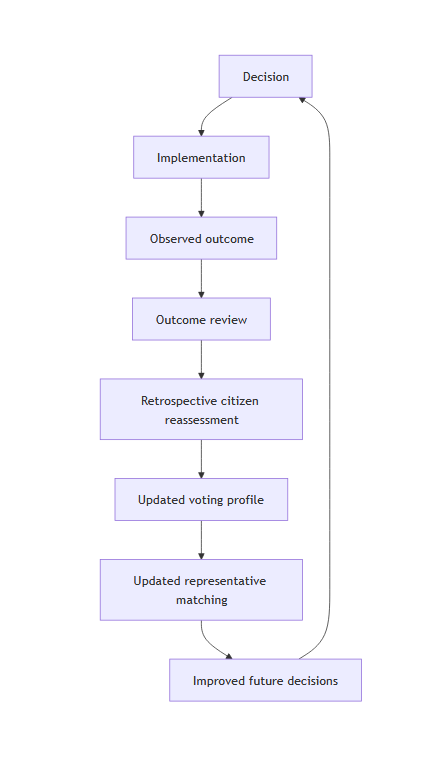

# Learning Democracy

## A Framework for Continuous Representation and Democratic Learning

**Working white paper draft**  
**Version: 0.1**
**Author: Jai Shaw**

---

## Executive Summary

Learning Democracy is a proposed governance framework designed to preserve the legitimacy of democratic participation while reducing the participation burden placed on ordinary citizens. Its central premise is that citizens should remain democratically represented even when they are too busy, disengaged, uncertain, or overloaded to vote directly on every issue.

Most existing democratic systems rely on periodic elections. Citizens choose representatives at fixed intervals, usually from a limited set of candidates or parties, and then have relatively weak influence over the many decisions made between elections. Direct democracy addresses this weakness by allowing citizens to vote directly, but it creates an unrealistic information and attention burden. Liquid democracy improves on both by allowing citizens to delegate votes flexibly, but it still requires citizens to actively choose, monitor, and update delegates.

Learning Democracy proposes a different approach: representation is generated through demonstrated alignment. Citizens build a democratic profile by voting on seed decisions, live decisions, and retrospective outcome reviews. Representatives build public voting records. The system compares citizen profiles with representative records and automatically matches citizens to aligned representatives within specific domains of decision-making. Citizens may still vote directly whenever they choose. Direct votes override delegated representation.

The system is intended to combine five core mechanisms:

1. **Continuous representation** — citizens remain represented between moments of active participation.
2. **Alignment-based delegation** — representation flows to people whose public voting record best matches the citizen's demonstrated values and judgments.
3. **Open representative participation** — any verified citizen or member may become eligible to receive delegated support by developing a public voting record and meeting participation and transparency requirements.
4. **Structured proposal prioritization** — issues and proposals are ranked through transparent signals rather than hidden agenda control.
5. **Democratic learning** — major decisions include expected outcomes, costs, risks, and tradeoffs, and are later reviewed against real outcomes so future representation can adapt.

This paper presents Learning Democracy as a governance framework rather than a complete national constitution. Its primary worked example is a mutual insurance organization, because mutual insurance combines shared resources, shared risk, member ownership, long-term planning, and measurable outcomes. These features make it a practical test environment for democratic learning before considering larger-scale public-sector applications.

The proposal is not a claim that better representation automatically produces wise decisions. Nor does it eliminate the need for rights protection, courts, regulators, professional administration, or expert advice. Its more modest claim is that democratic systems can be designed to make representation more adaptive, participation more scalable, institutional memory more structured, and citizen learning more consequential.

Key unresolved questions remain. These include legal feasibility, system security, coercion resistance, representative capture, agenda capture, outcome attribution, and public trust in algorithmic matching. These questions are not incidental. They are central to whether any version of Learning Democracy could become legitimate in practice.

## System at a Glance

1. Citizens create a democratic profile.
2. Representatives build public voting records.
3. The system matches citizens to representatives by domain.
4. Delegated votes flow to the top aligned representatives.
5. Citizens can vote directly whenever they choose.
6. Proposals include expected outcomes and tradeoffs.
7. Outcomes are reviewed after implementation.
8. Retrospective votes update future representation.



---

# 1. Introduction

## 1.1 The Problem

Most citizens continue to support democracy as an idea. The principle that people should have a voice in the systems that govern them remains powerful. Yet many citizens are dissatisfied with how democratic systems function in practice.

Common concerns include weak accountability between elections, the influence of organized and wealthy interests, short-term decision-making, political point-scoring, repeated policy failures, and limited institutional learning. Citizens may feel that they are formally sovereign but practically distant from the decisions made in their name.

Modern democracy has changed in many ways over time. Suffrage expanded. Parties evolved. Electoral systems changed. Courts, regulators, public administrations, and independent electoral institutions developed. However, the foundations of modern representative democracy were designed for a world before computers. Today we also have the internet, instant communication, digital identity systems, large-scale data processing, and new forms of coordination that were unavailable when modern representative institutions first developed.

This creates a central question: if democracy were being designed today, would we build it the same way?

## 1.2 The Central Question

The question is not whether democracy should be replaced. The question is what democratic principles should be preserved, and what democratic mechanisms can now be improved.

The principles worth preserving include citizen equality, legitimacy through consent, accountability, public reason, peaceful transfer of authority, protection against arbitrary power, and the right of citizens to participate in decisions that affect them.

The mechanisms most open to improvement include representation, delegation, agenda-setting, policy review, institutional learning, and the relationship between citizen attention and democratic influence.

## 1.3 Core Thesis

Democracy does not need to become direct democracy in order to become more responsive. Most people cannot and should not be expected to vote on every issue. Citizens have work, families, responsibilities, limited time, limited information, and varying levels of interest in different domains.

Learning Democracy proposes that democracy can instead become more adaptive by combining continuous representation, alignment-based delegation, open representative participation, structured proposal prioritization, retrospective outcome review, and democratic learning.

The goal is not to make citizens vote more often. The goal is to ensure that when citizens do not vote, their democratic influence does not disappear or become locked into a representative chosen years earlier under broad and imperfect electoral conditions.

## 1.4 Terminology

In government contexts, participants are referred to as **citizens**. In organizational contexts, they are referred to as **members**. Unless otherwise specified, the governance mechanics described in this paper apply to both.

The term **representative** refers to a participant who has opted into public participation and may receive delegated support through alignment matching. This differs from an elected official in traditional representative democracy. A representative in Learning Democracy does not gain authority simply by standing for office. Authority emerges from demonstrated alignment with citizens or members.

---

# 2. Existing Democratic Models

Learning Democracy is best understood in relation to three existing models: representative democracy, direct democracy, and liquid democracy. It borrows from each but attempts to address weaknesses that remain unresolved.

## 2.1 Representative Democracy

Representative democracy allows citizens to elect representatives periodically. This model is scalable, stable, administratively practical, and compatible with large populations. It allows citizens to delegate political work to people who can devote time to legislation, negotiation, oversight, and public decision-making.

However, representative democracy has significant weaknesses. Representatives may drift from voters between elections. Citizens must often choose bundled party platforms rather than express preferences issue by issue. Accountability cycles are slow. Political influence may concentrate through parties, donors, lobbyists, media ecosystems, and organized interests. A citizen who strongly agrees with a representative on one domain may be forced to accept the same representative's position across many unrelated domains.

Traditional representation also has a participation gap. Citizens are highly consequential during election periods but have limited structured influence between them. This produces a mismatch between the frequency of governance decisions and the frequency of citizen control.

## 2.2 Direct Democracy

Direct democracy allows citizens to vote directly on decisions. Its central strength is direct legitimacy. Citizens make decisions themselves rather than transferring authority to representatives.

However, direct democracy creates serious practical problems at scale. Most citizens cannot track every issue. The information burden is high. Participation may be inconsistent. Decisions may be dominated by activists, retirees, political hobbyists, highly organized interest groups, or citizens with unusually high time availability. Busy citizens may be formally included but practically underrepresented.

Direct democracy can also encourage shallow decision-making if citizens are asked to vote frequently on complex matters without adequate deliberation, expert input, or time to understand consequences.

## 2.3 Liquid Democracy

Liquid democracy allows citizens to vote directly or delegate their vote to another person. It is more flexible than fixed representative democracy because delegation can be changed. It is less burdensome than direct democracy because citizens can delegate in areas where they lack time or expertise.

However, liquid democracy still requires citizens to actively choose and monitor delegates. Delegation can become stale. Influence may concentrate around highly visible figures. The model does not automatically solve agenda formation, proposal quality, outcome review, or institutional learning.

Learning Democracy can be seen as an extension of liquid democracy. It retains the ability to vote directly, but delegation is generated through demonstrated alignment rather than requiring constant manual delegate selection.


| Feature | Representative Democracy | Direct Democracy | Liquid Democracy | Learning Democracy |
|----------|----------|----------|----------|----------|
| Continuous representation between participation events | Limited | No | Partial | Yes |
| Direct citizen voting | Limited | Yes | Yes | Yes |
| Delegation of influence | Elections only | No | Manual delegation | Automatic alignment-based delegation |
| Domain-specific representation | Rare | No | Possible | Core feature |
| Citizen influence between elections or votes | Weak | N/A | Moderate | Strong |
| Open entry to representation | Limited | N/A | Yes | Yes |
| Need to actively manage delegates | N/A | N/A | Yes | No |
| Representation adapts automatically over time | No | N/A | Limited | Yes |
| Proposal prioritization framework | External | External | External | Integrated |
| Outcome reviews | Rare | Rare | Rare | Core feature |
| Retrospective reassessment of decisions | No | No | No | Yes |
| Institutional learning mechanism | Weak | Weak | Weak | Core feature |
| Ability to override representatives on individual issues | No | N/A | Yes | Yes |
| Participation burden on average citizen | Low | High | Medium | Low |
| Scalability to large populations | High | Low | Medium–High | High |
| Primary source of legitimacy | Elections | Direct participation | Delegation choice | Representation plus continuous learning |

---

# 3. Design Principles of Learning Democracy

## 3.1 Citizens Remain Represented

A citizen should not lose democratic influence simply because they are busy. In most democratic systems, non-participation often means silence. Learning Democracy treats non-participation differently. If a citizen has previously expressed values and judgments through a voting profile, the system can continue to represent them through aligned representatives.

This does not force participation. It preserves influence between moments of participation.

## 3.2 Representation Should Continuously Adapt

Representation should update as citizens' values and judgments evolve. A citizen may change views after new evidence, after policy outcomes become clear, or after personal circumstances change. Representation should not remain locked to a past election, a party identity, or a static delegation choice.

Learning Democracy therefore treats representation as a continuing relationship between citizen profiles and representative voting records.

## 3.3 Anyone Can Become a Representative

Representation should be open-entry. Influence should emerge from citizen alignment rather than party endorsement, campaign funding, or electoral office.

Any verified citizen or member may opt in as a matchable representative, subject to requirements such as identity verification, public voting record, minimum participation level, conflict-of-interest disclosure, and acceptance of conduct and transparency rules.

This does not mean everyone immediately receives power. It means everyone has a pathway to earning influence through public participation and demonstrated alignment.

## 3.4 Democracy Should Learn

Democratic systems should learn from outcomes. Major decisions should include expected outcomes, costs, risks, and tradeoffs before they are made. After implementation, outcomes should be reviewed. Citizens should then be able to reassess whether they still support the decision in light of what occurred.

This creates a structured learning loop: decision, outcome, review, retrospective reassessment, updated representation, and improved future decisions.

## 3.5 Citizens Retain Final Authority

Delegation should reduce participation burden, not remove citizen agency. Citizens can vote directly whenever they choose. Direct votes override delegated representation for that issue.

This means Learning Democracy is not a system where representatives replace citizens. It is a system where representatives act by default when citizens choose not to act directly.

## 3.6 Democratic Legitimacy Requires Privacy and Auditability

Any democratic system must protect citizens from coercion and vote-buying. Votes must be auditable without creating proof that allows a citizen to demonstrate to a third party how they voted. This is especially important for legally binding decisions.

Learning Democracy therefore depends on privacy-preserving verification, coercion resistance, system transparency, and public auditability. These security properties are not optional implementation details. They are legitimacy requirements.

---

# 4. Core System Architecture

## 4.1 Citizens or Members

Citizens are verified participants in the democratic system. In an organizational context, these are members.

Citizens can create a democratic profile, vote directly, delegate automatically through alignment matching, review representatives, participate in retrospective reviews, and update their profile over time.

The citizen profile is not a personality profile and should not be treated as an opaque psychological model. It is a record of democratic judgments: how the citizen has voted on seed decisions, live decisions, retrospective reviews, and domain priorities.

## 4.2 Representatives

Learning Democracy distinguishes between matchable representatives and active representatives.

### 4.2.1 Matchable Representatives

Any citizen may opt in as a matchable representative. Requirements may include verified identity, a public voting record, minimum participation levels, conflict-of-interest disclosure, and acceptance of conduct and transparency rules.

Being matchable does not grant power. It only makes a citizen eligible to receive delegated support from others whose profiles align with that representative's public record.

### 4.2.2 Active Representatives

Active representatives are matchable representatives who receive sufficient delegated support. They may participate in formal representative voting and may gain rights such as proposal sponsorship, participation in structured deliberation, oversight requests, audit requests, or eligibility for temporary councils or delegate roles.

Active status should not be permanent. If a representative stops participating, repeatedly fails to vote, or no longer receives sufficient delegated support, active status can be reduced or removed according to transparent rules.

## 4.3 Domains

Representation is calculated by domain. A citizen may be represented by different people in different areas of decision-making.

Possible domains include finance, health, education, infrastructure, environment, risk management, member services, claims policy, reserve policy, and governance reform.

Domain-specific representation prevents a single representative from becoming the default voice for a citizen across all issues. A citizen may align with one representative on financial prudence, another on member support, and another on governance reform.

---

# 5. Citizen Onboarding and Initial Profile Creation

## 5.1 Purpose

The onboarding process creates an initial representation profile without requiring deep political knowledge. It allows citizens to become represented before they have participated in many live decisions.

The process should be manageable, neutral, and accessible. It should not be a political quiz designed to manipulate citizens into categories. It should be a structured introduction to the recurring tradeoffs that the system governs.

## 5.2 Initial Profile Setup

New citizens complete a guided onboarding process. They review a manageable number of past, current, or hypothetical decisions. These decisions should be real or realistic, clearly explained, domain-diverse, accompanied by neutral summaries, and framed around actual tradeoffs.

In a mutual insurance organization, example onboarding questions might include:

- Should premiums be lower now, or should reserves be higher for future claims?
- Should more funding go to prevention programs or claim payouts?
- Should coverage be broad and shallow, or narrower and deeper?
- Should the organization prioritize lower cost, higher protection, or long-term solvency?

The purpose is not to find perfect matches immediately. The purpose is to create enough initial signal for representation to begin.

## 5.3 Profile Signals

Citizen profiles may include votes on seed decisions, domain priorities, optional issue importance ratings, optional confidence levels, later direct votes, and retrospective votes.

The system should avoid unnecessary psychological inference. Matching should be based on democratic decisions and clear preference signals, not hidden personality modeling.

## 5.4 Recalibration

Citizens periodically review recent decisions, current representative matches, retrospective outcomes, and whether their profile still reflects their values. The purpose is alignment maintenance, not forced participation.

Recalibration should be optional but encouraged. The system should make clear when a citizen's profile is old, sparse, or based on limited recent decisions.

## 5.5 Onboarding Question Set Design

The onboarding process must balance comparability and adaptation. A fully fixed question set creates strong comparability but may become stale. A fully individualized question set may improve relevance but risks unfairness, manipulation, and reduced auditability.

The recommended structure is a layered onboarding model.

### 5.5.1 Permanent Core Questions

Permanent core questions are a stable set of core decisions answered by every citizen or member. They establish baseline alignment, allow long-term comparison across cohorts, reduce accusations of selective question framing, and provide a shared reference point for the system.

These questions should focus on recurring governance tradeoffs such as short-term affordability versus long-term stability, broad coverage versus deeper targeted support, individual responsibility versus collective protection, prevention spending versus current payouts, and member flexibility versus fraud control.

### 5.5.2 Annual Cohort Questions

Annual cohort questions are updated periodically. They incorporate recent organizational decisions, include newer reviewed outcomes, keep onboarding relevant to current conditions, and prevent the system from relying only on old cases.

Each annual cohort should receive the same rotating set to preserve fairness within that intake period. Some overlap with previous years should be retained to preserve comparability across cohorts.

### 5.5.3 Optional Domain-Specific Questions

Members may answer additional questions in domains where they want more accurate representation. These questions improve matching quality in specific areas while avoiding overload for all members.

In a mutual insurance organization, optional domains might include premium setting, reserves, claims policy, fraud prevention, preventative investment, hardship support, and governance reform.

## 5.6 Questions With Known Outcomes

For decisions with known outcomes, onboarding should use a two-step format. First, citizens see only what was known at the time of the original decision and vote as they would have voted then. Second, the later outcome is revealed, including benefits, costs, and tradeoffs. Citizens then indicate whether they would still support the decision retrospectively.

This captures both initial judgment under uncertainty and willingness to revise judgment after evidence.

## 5.7 Media and Accessibility

Onboarding questions may be presented through short text summaries, diagrams, videos, audio explanations, and detailed supporting documents. This reduces cognitive burden and makes serious onboarding more accessible.

All media should be neutral, auditable, and version-controlled to prevent persuasive framing from influencing profile creation.

---

# 6. Alignment-Based Representation

## 6.1 The Representation Problem

Most citizens cannot track every issue. Fixed elections produce stale representation. Manual delegation requires too much effort for many citizens.

Learning Democracy addresses this through alignment-based representation. Citizens are not asked to constantly choose delegates. Instead, the system compares citizen voting profiles with public representative voting records.

## 6.2 Voting Profiles

Citizens build profiles from seed decisions, direct votes, retrospective votes, and domain priorities. Representatives build public records from their formal votes.

The matching question is simple: which representatives have demonstrated voting patterns most aligned with this citizen's expressed judgments in this domain?

## 6.3 Alignment Matching

Delegation is based on demonstrated decision alignment, not popularity alone. The algorithm should be simple, transparent, auditable, and explainable.

Alignment is calculated using binary agreement on comparable decisions. Retrospective votes replace original votes for matching purposes. Matching is performed independently within each domain.

The most recent twenty comparable decisions receive full weighting. The next fifty comparable decisions receive half weighting. Older decisions are archived and do not contribute to matching. This allows enough history to preserve continuity while allowing citizens and representatives to change positions over time.

Abstentions are treated as neutral for matching and do not contribute to agreement calculations. This avoids treating uncertainty, recusal, or deliberate neutrality as either agreement or disagreement.



## 6.4 Confidence-Adjusted Matching

Raw agreement percentages can be misleading when very little data is available. A representative who matches a citizen on four out of four decisions should not automatically outrank a representative who matches on ninety out of one hundred decisions.

To avoid overconfidence from small samples, the system uses confidence-adjusted alignment. Each representative starts from a neutral prior, such as five assumed matches and five assumed misses.

The adjusted alignment score is:

```text
adjusted alignment = (real matches + 5) / (real comparable decisions + 10)
```

For example, four matches from four comparable decisions produces an adjusted score of 9/14, or 64.3%. Two matches and two misses produces an adjusted score of 7/14, or 50%. Ninety matches and ten misses produces an adjusted score of 95/110, or 86.4%.

This allows promising new representatives to gain support while preventing very small voting records from producing misleadingly high alignment scores.

## 6.5 Top Three Representative Model

For each domain, each citizen is matched with up to three aligned representatives. This reduces dependence on any single representative and may improve resilience against representative capture, corruption, and inactivity.

A citizen's delegated vote is distributed proportionally across their top matched representatives. Higher alignment receives a greater share of delegated voting weight. Citizens may directly override delegation on any active proposal.

For active proposals, citizens may be allowed to override their default delegated representation for that proposal only. This allows a citizen to assign their delegated vote to a representative they believe has particular expertise, lived experience or credibility on the specific issue being decided. If the selected representative has a much lower alignment score than the citizen's default matched representatives, the system may display a warning. The purpose of the warning is not to prevent the override, but to create reflection and help detect possible tampering, coercion or outside influence. Once the proposal is resolved, the citizen's normal alignment-based delegation resumes.

## 6.6 Representative Diversity Requirements

Alignment-based representation relies on having a sufficiently diverse pool of active representatives. If too few representatives participate in a domain, most citizens may be matched to substantially the same people, reducing the value of alignment.

The system should monitor the number of active representatives, concentration of delegated support, diversity of voting patterns, and average overlap between citizen representative matches.

If representative diversity falls below acceptable levels, the system may encourage additional representative participation, reduce the number of matched representatives, display warnings about reduced matching quality, or temporarily fall back to simpler representation models.

The exact thresholds should be determined through simulation and pilot testing. However, the principle is clear: representation quality depends not only on the matching algorithm but also on the diversity of available representatives.

## 6.7 Tie Handling

If more than three representatives are equally matched, the system should choose three using stable random tie-breaking. This avoids constant changes when the underlying record has not changed.

Stable tie-breaking should be transparent and auditable, but not easily manipulated.

## 6.8 Direct Override

Citizens may vote directly on any active issue. Direct votes override delegated votes for that issue.

Direct overrides must not create vote receipts or allow citizens to prove their vote to third parties.

## 6.9 Delegation Continuity and Representative Participation Rules

Citizens are shown their top three representatives per domain, but the system maintains a longer ranked backup list.

If a representative votes, their allocated share follows their vote. If they formally abstain, their allocated share abstains. If they do not vote, their share rolls down to the next available matched representative. If they recuse, their share also rolls down.

Repeated non-voting adds a temporary penalty to the representative's matching score in the relevant domain. Three months of no participation may trigger a matching penalty. Six months of no participation may remove active representative status. Persistent inactivity removes the representative from active status and notifies affected citizens.

These rules distinguish deliberate abstention from non-participation. They also preserve citizen representation when representatives become inactive.

---

# 7. Proposal Formation and Prioritization

## 7.1 The Agenda Problem

Voting systems often focus on how votes are counted. Equally important is which issues reach decision. Agenda capture may be as powerful as vote manipulation.

A system that improves representation but leaves agenda-setting opaque may simply move political power from elections to proposal control. Learning Democracy therefore requires transparent proposal formation and prioritization.

## 7.2 Proposal Sources

Issues and proposals may be initiated by citizens, representatives, operational teams, auditors, expert panels, member petitions, and governance review bodies.

Multiple proposal sources reduce the chance that one office, committee, or interest group controls the agenda.

## 7.3 Issue Versus Proposal

An issue identifies a problem requiring attention. A proposal identifies a specific action or decision.

For example, rising claim costs are an issue. Increasing prevention funding by fifteen percent is a proposal.

Separating issues from proposals matters because several proposals may respond to the same issue. A democratic system should avoid forcing citizens to vote on a single pre-framed solution when multiple options are available.

## 7.4 Prioritization Signals

Proposed issues may be ranked by number of supporting citizens, delegated support weight, urgency, financial impact, risk exposure, legal or regulatory necessity, number of members affected, time unresolved, and strategic importance.

These signals should be public and auditable. Citizens should be able to understand why an issue has moved forward or why it remains pending.

## 7.5 Filtering and Anti-Spam Measures

Open proposal systems are vulnerable to spam, duplication, symbolic proposals, and coordinated flooding. Learning Democracy therefore requires minimum support thresholds, duplicate proposal merging, domain classification, proposal quality requirements, and a clear separation between informal suggestions and formal proposals.

Anti-spam measures must themselves be governed transparently. Otherwise, filtering becomes another route for agenda capture.

## 7.6 Proposal Development

Significant proposals should include a problem statement, options considered, expected outcomes, risks, costs, implementation requirements, review timeframe, and historically similar decisions.

This creates a decision record before the vote. The record defines what the proposal promised, what tradeoffs were acknowledged, and what evidence would later indicate success or failure.

## 7.7 Use of Citizen Assemblies or Deliberative Panels

Citizen assemblies or deliberative panels may be introduced later as proposal-development tools. They are not necessary to the core Learning Democracy mechanism, but they may improve proposal quality before wider voting.

Their role would be advisory and developmental rather than foundational. Learning Democracy should not depend on all citizens entering deep deliberation for every decision.

## 7.8 Parallel Democratic Processing

Traditional representative systems often process issues through a single central agenda. Parliament, council, or board time becomes a bottleneck. Even when many problems require attention, only a limited number can be debated, amended, and decided through the central decision-making body.

Learning Democracy may increase democratic throughput by allowing multiple proposal-development processes to occur in parallel. Different citizen assemblies, representative panels, expert-supported working groups, or domain-specific committees could examine separate issues at the same time. For example, one group may develop proposals on reserve policy while another examines claims standards, another reviews preventative investment, and another considers governance reform.

This does not mean every working group has final authority. Parallel groups may investigate issues, gather evidence, consult affected members, develop options, and prepare proposals. Final legitimacy still depends on the wider democratic process: transparent prioritization, representative voting, direct citizen participation where desired, and later outcome review.

This structure may allow democratic systems to handle more complexity without requiring every citizen, representative, or central assembly to deliberate on every issue. It also reduces dependence on a single parliamentary agenda and may make democratic institutions more responsive to multiple problems at once.

## 7.9 Expected Outcomes and Tradeoffs

Significant proposals should state both intended positive outcomes and expected costs, risks, and tradeoffs. Tradeoffs should be explicit before voting. Citizens should know what downside they are accepting.

Tradeoffs may include financial cost, reduced flexibility, higher short-term burden, increased risk exposure, delayed benefits, unequal effects across member groups, and administrative complexity.

This prevents later reviews from judging decisions unfairly against outcomes that were never promised. It also prevents proposals from being presented only through benefits while hiding costs.

---

# 8. Democratic Learning

## 8.1 Why Current Systems Learn Poorly

Elections measure broad approval but rarely evaluate specific decisions. Policy memory is weak. Citizens often lack structured opportunities to revisit prior decisions. Failed policies can be repeated because lessons are not formally integrated into future representation.

Learning Democracy makes retrospective review part of the democratic process.

## 8.2 Decision Records

Major proposals should state expected benefits before voting. They should also state expected costs, risks, and tradeoffs.

A decision record should include what the proposal aimed to improve, what it was expected to cost, what risks were knowingly accepted, who was expected to benefit, who might be burdened, what timeframe was expected, and what evidence would later indicate success, partial success, or failure.

The decision record becomes the baseline for outcome review.

## 8.3 Outcome Reviews

Decisions are reviewed after a defined period. Reviews compare expected benefits with observed benefits, expected costs with actual costs, expected tradeoffs with actual tradeoffs, predicted risks with realized risks, and intended beneficiaries with actual beneficiaries.

Reviews should not ask only, "Did this produce a good result?" They should ask, "Given what was known at the time, was this a reasonable tradeoff, and what can be learned now?"

This distinction matters because good decisions can have bad outcomes due to external events, and bad decisions can have good outcomes due to luck. Democratic learning should evaluate both judgment and consequence.

A good example is pandemic readiness. If no pandemic occurs, the costs of preparedness are visible while many of the benefits remain unrealized. However, the judgment behind the decision may still be sound because the underlying risk remains present and society may reasonably choose to maintain resilience against low-probability, high-impact events.

## 8.4 Review Categories

Reviews may classify outcomes as successful, partially successful, unsuccessful, indeterminate, not yet measurable, or made irrelevant by intervening events.

The category "indeterminate" is essential. A democratic learning system should not create false certainty where evidence is weak.

## 8.5 Review Panel Composition

Reviews should be conducted by multiple independent reviewers. Reviewer groups may include subject-matter experts, affected stakeholders, auditors, data analysts, ethicists where relevant, and AI-assisted analysis tools.

No single expert or institution should control the review. Competing interpretations should be published when consensus is not possible.

AI may assist by summarizing evidence, identifying inconsistencies, comparing expected and actual outcomes, mapping tradeoffs, generating alternative interpretations, and detecting missing evidence. AI should not be treated as an authority. AI outputs should be transparently defined and clearly marked as AI output.

## 8.6 Retrospective Voting

Citizens may retrospectively reassess a past decision after outcomes are known. This does not rewrite history. Original votes and original representative positions remain preserved.

Retrospective votes update future representation only.

This is a core distinction. Learning Democracy does not allow citizens to escape responsibility for past decisions by changing the historical record. It allows them to learn from outcomes and update future representation.

## 8.7 Democratic Learning Loop

The democratic learning loop is:

1. Decision.
2. Outcome.
3. Review.
4. Retrospective citizen reassessment.
5. Updated representation.
6. Improved future decisions.

Over time, the system builds institutional memory. Citizens, representatives, and operational teams can see not only what was decided, but what was expected, what occurred, and how citizen judgment evolved.



---

# 9. Worked Example: Mutual Insurance Organization

## 9.1 Why Mutual Insurance?

Mutual insurance is a strong test case because it combines shared resources, shared risk, member ownership, long-term planning, measurable outcomes, and collective responsibility.

It is easier to understand than national constitutional reform. It also resembles one of the core functions of government: pooling resources to reduce risk and increase freedom.

## 9.2 Analogy Between Insurance and Nationhood

Insurance organizations and nations both provide security that allows individuals to pursue goals with reduced catastrophic risk.

Insurance pools premiums, protects against loss, manages claims, and invests in prevention. Nations pool taxes, provide public services, protect citizens from collective risks, and invest in infrastructure and resilience.

The analogy should not be overstated. Nations also involve rights, identity, territory, culture, coercive authority, and constitutional order. But mutual insurance provides a useful limited environment for testing governance mechanisms involving shared resources and collective risk.

## 9.3 Core Governance Challenge

Members want fair premiums, fair claim handling, long-term solvency, protection against abuse, and efficient administration. But most members do not want to attend constant governance meetings.

This creates a natural use case for Learning Democracy. Members need voice and legitimacy without being forced into continuous participation.

## 9.4 Learning Democracy in a Mutual Insurance Organization

Members create initial profiles, vote directly when desired, allow automatic delegation when inactive, and participate in retrospective reviews.

Representatives are members who opt into public participation. Active representatives emerge through delegated alignment. Representatives vote publicly on formal proposals.

Operational teams handle day-to-day administration, implement policies, report outcomes, and remain distinct from democratic legitimacy.

## 9.5 Scope of Democratic Authority

A mutual insurance organization using Learning Democracy would need a clear division of authority.

Some decisions may be member-governed, such as broad coverage priorities, reserve policy preferences, member support principles, prevention investment priorities, governance rules, and retrospective evaluations.

Some decisions may be advisory, informing board or executive judgment without legally binding them.

Some decisions must remain operational, such as individual claim processing, staffing, vendor management, fraud investigation, actuarial calculations, and day-to-day administration.

Some decisions may be constrained by law, solvency requirements, fiduciary duties, prudential regulation, or contractual obligations.

Where democratic preference conflicts with legal or fiduciary obligations, legal obligations must prevail. Learning Democracy should not be framed as a mechanism for overriding regulatory or fiduciary duties. Instead, it should identify where member legitimacy can shape policy within lawful constraints.

## 9.6 Example Policy Domains

Policy domains may include premium setting, coverage rules, reserve policy, claims standards, fraud prevention, preventative investment, member support, and governance reform.

## 9.7 Example Decision

A proposal may allocate ten percent of annual surplus to preventative risk-reduction programs. Expected outcomes might include reduced future claims, improved member resilience, and maintained reserve adequacy.

After three years, the organization reviews claim frequency, program participation, financial sustainability, reserve effects, and member retrospective judgment.

## 9.8 End-to-End Example: Preventative Risk Reduction Program

Sarah joins the mutual insurance organization. She completes onboarding by answering permanent core questions, annual cohort questions, and optional risk-management questions. A voting profile is created.

Sarah is matched to three representatives within the risk management domain. Alignment is calculated using weighted binary agreement, confidence-adjusted matching, and retrospective voting history. Her delegated vote is distributed proportionally across her top matched representatives.

Claims costs have increased for three consecutive years. Members, representatives, and operational staff submit proposals. The issue receives sufficient support to enter formal review.

Several proposals are prepared. Proposal A recommends allocating ten percent of annual surplus to preventative risk-reduction programs. The proposal includes expected benefits, expected costs, expected tradeoffs, implementation requirements, a review timeframe, and historically similar decisions.

Sarah does not actively participate in this proposal. Her delegated vote follows her matched representatives. Other members choose to vote directly. Active representatives cast public votes.

Proposal A passes. Operational teams implement the program. Funding is allocated and prevention initiatives begin.

The organization tracks claim frequency, claim severity, member participation, administrative costs, and reserve adequacy.

Three years later, the decision enters formal review. Experts, auditors, and AI-assisted analysis review results. The review compares expected outcomes, actual outcomes, expected tradeoffs, and realized tradeoffs.

Members receive a summary of the review. Sarah re-evaluates the original decision. She decides the program was successful and confirms support. Other members may change their assessment.

Retrospective votes update member voting profiles. Representative alignment scores are recalculated. Delegated voting relationships adjust automatically.

Future preventative-investment proposals are evaluated using the original decision, measured outcomes, and retrospective voting record. The organization becomes progressively better informed about which tradeoffs members prefer, which policies achieve desired outcomes, and which representatives most accurately reflect member values.

## 9.9 What This Demonstrates

The example demonstrates initial onboarding, alignment-based delegation, proposal formation and prioritization, representative voting, direct member participation, outcome review, retrospective voting, adaptive representation, and continuous democratic learning.

It also illustrates why Learning Democracy may be easier to test in organizations than in national governments. The stakes are real, but the domain is narrower, outcomes are more measurable, and legal authority can be more carefully bounded.

---

# 10. Application to National and State Governance

## 10.1 Long-Term Relevance

Learning Democracy may apply to governments because governments also pool resources, manage collective risk, make long-term decisions, require legitimacy, and suffer from weak feedback loops.

However, government use is far more complex than organizational use. States involve constitutional rights, coercive authority, courts, police powers, taxation, public administration, international relations, military power, and minority protections.

## 10.2 Potential Government Applications

Initial public-sector applications could include local councils, participatory budgeting, state-level advisory systems, public policy review platforms, long-term democratic reform pilots, and citizen outcome-review experiments.

These are more plausible near-term applications than replacing parliamentary or congressional systems.

## 10.3 Areas Requiring Further Design

National and state governance would require further design in constitutional law, judicial independence, federalism, emergency powers, foreign affairs, defence, public administration, rights protections, election law, digital identity, and voting infrastructure.

Learning Democracy should not be presented as a complete national constitution. It should be presented as a governance framework that can be tested in organizations and gradually evaluated for larger-scale democratic use.

Learning Democracy should operate within constitutional and legal limits. Democratic responsiveness does not remove the need for rights protections, minority protections, judicial independence, and constraints on majoritarian power.

## 10.4 Recommended Position

The recommended position is incremental. Learning Democracy should begin in organizations, cooperatives, mutuals, nonprofits, member associations, and advisory public-sector settings. Only after empirical testing should larger constitutional applications be considered.

---

# 11. Security, Integrity and Trust

## 11.1 Scope Note

The purpose of this section is not to propose new voting security mechanisms. The purpose is to identify the security properties that any implementation of Learning Democracy must satisfy.

Where established best practices, election security research, cryptographic methods, or expert system design recommendations exist, they should take precedence over illustrative implementation details discussed here.

## 11.2 Core Requirements

A legitimate implementation requires vote privacy, coercion resistance, vote verifiability, public auditability, and system transparency.

The system must allow public confidence in outcomes without exposing individual citizens to coercion or retaliation.

## 11.3 Secret Ballot Principle

Citizens must not be able to prove their vote to third parties. This protects against vote-buying and coercion.

This principle applies especially to direct votes and profile updates that could affect future representation. If a citizen can prove how they voted, then employers, family members, activists, criminal groups, political organizations, or financial interests may pressure them.

## 11.4 Hybrid Voting Model

Routine information review can occur online. Critical voting actions may require secure voting environments.

Secure environments may include private voting booths, controlled devices, no cameras, no observers, no vote receipts, and independent supervision.

The purpose of a hybrid model is to use digital systems where appropriate without assuming that all democratic actions should occur on personal devices in uncontrolled environments.

## 11.5 System Integrity Measures

Possible system integrity measures include open-source software, independent audits, immutable event logs, public verification of totals, multiple independent tallying authorities, strong identity verification, and tamper-evident infrastructure.

The system should be designed so that no single administrator, vendor, or institution can secretly alter outcomes.

## 11.6 Delegation Privacy

Some information should be public. Representative voting records and aggregate delegated support should be visible. Public records are necessary for accountability and alignment matching.

Other information should remain private. Individual citizen votes, individual delegation profiles, direct overrides, and profile changes should not be publicly attributable.

This creates a deliberate asymmetry: representatives trade privacy for public influence, while ordinary citizens retain the protections of private voting.

---

# 12. Top Risks and Criticisms

## 12.1 Risk 1: Representation Does Not Guarantee Wisdom

Better alignment does not automatically produce better decisions. Citizens may still be misinformed, short-term oriented, polarized, or vulnerable to persuasive misinformation.

However, research in collective intelligence, organizational governance and participatory decision-making suggests that groups can often outperform individual decision-makers when they draw upon diverse knowledge, perspectives and experiences. Organizations in which participants feel ownership of outcomes also tend to produce higher engagement, greater accountability and stronger long-term commitment to decisions.

Learning Democracy does not assume that citizens are always wise. Rather, it assumes that useful knowledge is widely distributed throughout a population and that legitimacy is strengthened when people have meaningful influence over decisions that affect them.

Learning Democracy improves legitimacy, representation and feedback. It does not guarantee wisdom. Outcome review and retrospective learning are designed to help citizens, representatives and institutions learn from experience over time, but they cannot eliminate poor judgment entirely.

## 12.2 Risk 2: Outcome Attribution Is Difficult

It may be hard to determine whether a decision caused a later outcome. External events may distort results. A policy may look successful because conditions improved for unrelated reasons, or unsuccessful because unexpected shocks occurred.

Reviews should allow uncertainty. Categories such as indeterminate and not yet measurable are essential. The goal is structured learning, not false precision.

## 12.3 Risk 3: Representative Capture and Agenda Capture

Powerful interests may attempt to influence which issues reach decision, how representatives vote, and which representatives receive support.

Representatives with significant delegated support may become targets for lobbying, bribery, intimidation, coordinated influence campaigns, media pressure, or reputational attacks. Public representative voting records improve accountability but also increase visibility.

Learning Democracy responds to this risk through distributed representation. Citizens are represented by multiple aligned representatives rather than a single delegate. Representation is distributed across many representatives rather than concentrated in a small elected body. Any citizen may become a representative, increasing the number of influence targets required for successful capture.

Citizens retain the right to vote directly on any proposal. Important or controversial issues are expected to attract increased direct participation, reducing reliance on delegated representation. Proposal prioritization must remain transparent and auditable. Multiple proposal sources should exist. Continuous citizen reassessment allows representatives who drift from citizen values to lose support.

Further research is required to determine whether Learning Democracy increases or decreases susceptibility to representative capture relative to existing democratic systems.

## 12.4 Risk 4: Complexity May Reduce Trust

Citizens may distrust systems they do not understand. Learning Democracy contains technical complexity in matching, privacy, auditability, and outcome review.

Citizen-facing design must remain simple. Citizens should be able to understand the practical actions available to them: vote directly, review representatives, update profile, and review outcomes.

Technical complexity should be auditable but not cognitively required for normal participation.

## 12.5 Risk 5: System Security and Coercion

Digital voting can be hacked, manipulated, or used for coercion if poorly designed. This risk is severe.

Learning Democracy should use secure voting environments for critical votes, secret ballot protections, open-source systems, independent audits, and publicly verifiable but privacy-preserving records.

The proposal should not be understood as an argument for naive online voting. It is a governance model that requires rigorous security design before implementation.

---

# 13. Research Agenda

## 13.1 Conceptual Research

Conceptual research should examine democratic legitimacy, representation theory, delegation theory, institutional learning, and comparison with liquid democracy and deliberative democracy.

Key questions include whether alignment-based delegation is democratically legitimate, how citizen agency is preserved, and whether retrospective voting improves accountability.

## 13.2 Technical Research

Technical research should examine alignment algorithms, privacy-preserving voting, delegation audits, scalable matching systems, manipulation detection, identity verification, and system resilience.

The matching algorithm should be tested for stability, bias, gaming, over-concentration, and interpretability.

## 13.3 Simulation Research

Simulation research should examine delegation stability, representative concentration, strategic voting, profile manipulation, domain-specific representation, representative diversity requirements, and the effects of direct participation spikes on major issues.

Simulations should test whether top-three representation reduces capture risk, whether confidence-adjusted matching behaves sensibly, and how the system responds to representative inactivity.

## 13.4 Organizational Pilots

Organizational pilots could occur in mutual insurance organizations, cooperatives, nonprofits, member associations, and online communities with real resource allocation.

Pilots should begin with advisory or limited-scope decisions before expanding to binding decisions.

## 13.5 Government Pilots

Government pilots could include local councils, participatory budgeting, advisory democratic platforms, policy review systems, and citizen outcome-review experiments.

These pilots should avoid constitutional overreach. The purpose should be to test mechanisms, not immediately replace existing democratic institutions.

## 13.6 Legal and Regulatory Research

Legal and regulatory research should examine corporate governance law, mutual insurance governance requirements, fiduciary obligations of directors and officers, solvency and prudential regulation, member voting rights, digital identity requirements, privacy and data protection law, electronic voting legislation, constitutional implications for public-sector adoption, and transition pathways from existing governance systems.

Key questions include:

- Which decisions can legally be delegated to Learning Democracy?
- Which decisions must remain with directors, executives, trustees, or elected officials?
- How should conflicts between democratic preference and legal obligations be resolved?
- What regulatory changes would be required for large-scale adoption?

---

# 14. Conclusion

Learning Democracy is a proposed governance framework, not a finished constitutional system. It aims to preserve democratic legitimacy while improving representation, participation scalability, accountability, proposal prioritization, and institutional learning.

The proposal begins from a simple observation: citizens should not lose democratic influence merely because they are busy. Nor should representation remain fixed to periodic elections when more adaptive mechanisms are possible.

Learning Democracy attempts to create a system where citizens remain represented, representatives earn influence through demonstrated alignment, citizens can directly override delegation, proposals include explicit tradeoffs, outcomes are reviewed, and future representation updates through democratic learning.

The mutual insurance organization offers a tractable environment for testing the model. It involves shared resources, shared risks, member ownership, and measurable outcomes. It is complex enough to matter but narrower than national government.

National and state applications remain directional and require substantial further research. Courts, rights protections, public administration, legal constraints, and institutional checks remain essential.

The core claim of Learning Democracy is not that democracy should be automated or that citizens should be replaced by algorithms. The core claim is that democracy should not merely count votes. It should help citizens remain represented, learn from outcomes, and improve collective decision-making over time.
